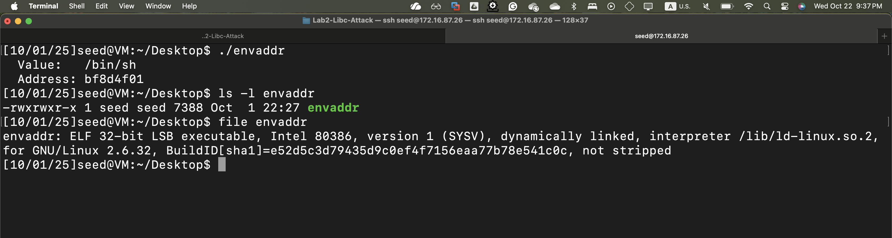
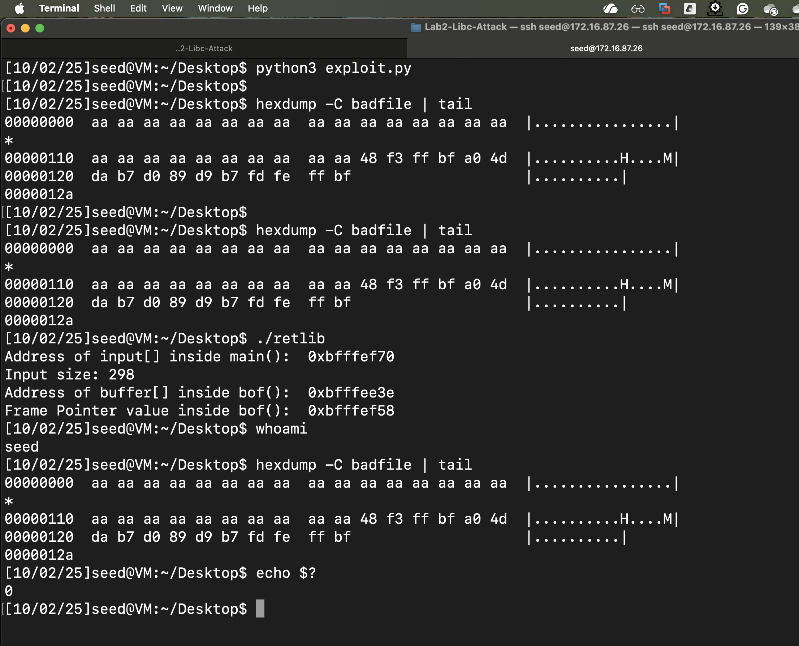

# Lab 2 — Libc-Attack

## Overview

This project implements a classic stack-based buffer overflow to demonstrate a **Return-to-libc (ret2libc)** attack on a 32-bit Linux binary with a non-executable stack (NX bit).

## Prerequisites

- 32-bit Linux VM (lab environment)
- `gcc` with multilib support (if building 32-bit on a 64-bit host)
- Python 3
- GDB (with **peda** or a similar helper is helpful)
- Seed image: https://seedsecuritylabs.org/lab_env.html

---

## Repository files

| File | Description |
|------|-------------|
| `retlib.c` | Vulnerable program with a stack-based buffer overflow. |
| `envaddr.c` | Helper utility to print the address of an environment variable. |
| `exploit.py` | Python script to generate the `badfile` payload. |
| `badfile` | Binary payload file generated by `exploit.py`. |
| `README.md` | This documentation. |
| `images/` | Screenshots of the exploitation process. |

### Image references





---

## Exploitation flow

The attack bypasses the non-executable stack by overwriting the saved return address to point to the `system()` function in `libc`.

**High-level steps:**

1. Disable ASLR (optional for lab reproducibility).
2. Find addresses for `/bin/sh`, `system()`, and `exit()`.
3. Construct a payload that overwrites the saved return address and places arguments for `system()` on the stack.
4. Run the vulnerable program with the crafted payload to spawn a shell.

### Detailed steps

1. **Disable ASLR (for repeatable addresses in this lab)**

   ```bash
   # As root
   echo 0 > /proc/sys/kernel/randomize_va_space
   ```

2. **Set up environment and find target addresses**

   ```bash
   # Make sure /bin/sh is set as an environment variable (used by envaddr)
   export MYSHELL=/bin/sh

   # Compile and run envaddr (see section "How to compile")
   ./envaddr
   # Example output: Address: 0xbfffff01
   ```

   ```gdb
   gdb -q ./retlib
   (gdb) run < badfile
   (gdb) p (void*) system
   (gdb) p (void*) exit
   ```

3. **Construct the payload**

   The `exploit.py` script produces a `badfile` that overflows the vulnerable buffer and overwrites the saved return address.

   **Typical payload layout (32-bit, little-endian):**

   ```
   [ padding up to saved EBP ]
   [ saved EBP (optional placeholder) ]
   [ system_addr (overwritten return address) ]
   [ exit_addr   (next return address, used by system as cleanup) ]
   [ sh_addr     (pointer to "/bin/sh" string) ]
   ```

   This layout ensures that when the function returns it jumps to `system()` with the address of `/bin/sh` as its argument. After `system()` returns, control goes to `exit()`.

4. **Execute the exploit**

   ```bash
   # Generate badfile (after updating exploit.py with discovered addresses)
   python3 exploit.py

   # Run vulnerable program (it reads badfile and triggers overflow)
   ./retlib
   ```

   If successful, `system("/bin/sh")` runs and spawns a shell.

---

## How to compile

1. Compile 32-bit vulnerable binary and helper:

```bash
# Compile retlib as 32-bit disabling stack protector and keeping stack non-executable
gcc -m32 -o retlib retlib.c -fno-stack-protector -z noexecstack

# Compile envaddr helper
gcc -m32 -o envaddr envaddr.c
```

> Note: Some toolchains require additional packages (multilib). On Debian/Ubuntu you may need `gcc-multilib` and `libc6-dev-i386`.

---

##  Exact compile commands — alternative placement

```bash
# Compile retlib and envaddr for 32-bit
gcc -m32 -fno-stack-protector -z noexecstack -o retlib retlib.c
gcc -m32 -o envaddr envaddr.c
```

> **Security note:** `-z noexecstack` marks the binary as not requiring an executable stack (demonstrates ret2libc bypass of NX). Do this **only** in a controlled lab VM.

---

##  Disable / re-enable ASLR (for reproducibility)

Disabling ASLR makes addresses repeatable in this lab. Re-enable it after testing.

```bash
# Disable (lab only; requires root)
sudo sysctl -w kernel.randomize_va_space=0

# Re-enable when done
sudo sysctl -w kernel.randomize_va_space=2
```

---

##  `envaddr` usage to get `/bin/sh` address

```bash
export MYSHELL=/bin/sh
./envaddr
# Example output: Address: 0xbfffff01
# Use this value as sh_addr.
```

---

## Example

```bash
export MYSHELL=/bin/sh
./envaddr
# Example: Address: 0xbfffff01

# After updating exploit.py with discovered addresses
python3 exploit.py
hexdump -C badfile | tail
# ... hexdump shows the little-endian addresses for system, exit, and "/bin/sh"

./retlib
# Program prints buffer addresses and, on success, you get a shell
whoami   # -> seed
echo $?  # -> 0
```

---

